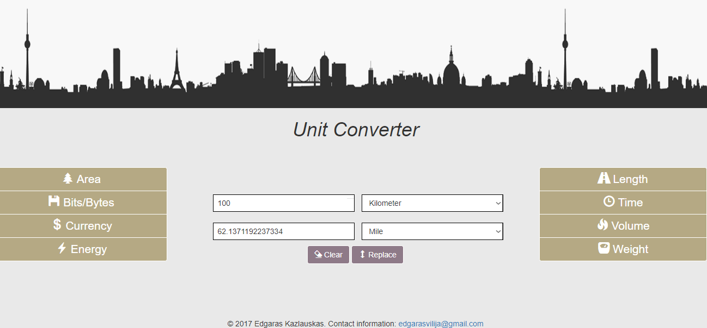

# Unit Converter

Web based unit converter which converts the most common units of measurement. 

Types of convertion included in the application:
	Area, Bits/Bytes, Currency, Energy, Length, Time, Volume, Weight
 
